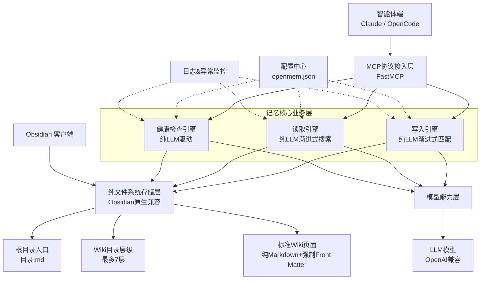
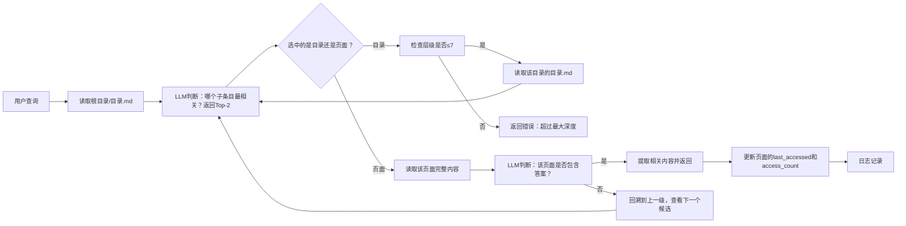
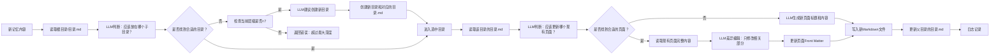
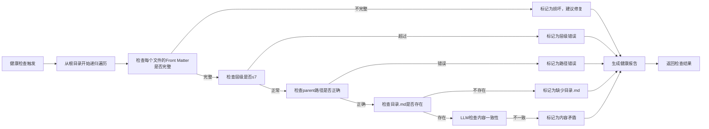

# 最终版：纯LLM驱动的Wiki式记忆MCP工具（极简无依赖）

完全按照您的最终要求实现，**彻底移除所有监控、索引、同步机制**，新增根目录`目录.md`作为唯一入口，强制7层深度限制和标准Front Matter格式。这是一个**零冗余、零副作用、100%可控**的最终架构。

## 一、最终架构概览



## 二、核心变更确认

✅ **已移除**：文件监控、所有索引、所有同步机制、所有缓存 
✅ **已新增**：根目录`目录.md`作为唯一入口 
✅ **已强制**：目录层级最多7层 
✅ **已强制**：每个Wiki条目必须包含完整元数据和摘要 
**核心原则**：**所有修改只能通过MCP工具进行**，文件系统是唯一真相源，没有任何后台进程、没有任何自动同步、没有任何隐藏状态。

## 三、纯文件系统存储规范（强制执行）

### 3.1 根目录结构

```
wiki-root/
├── openmem.json # 唯一配置文件
├── 目录.md # 强制根目录入口，记录整个仓库元信息
├── 00-个人/ # 一级目录
│ ├── 目录.md # 每个目录下都有自己的目录.md
│ ├── 健康.md
│ └── 学习/ # 二级目录
│ ├── 目录.md
│ └── Python学习笔记.md
├── 01-工作/
│ ├── 目录.md
│ └── 项目A.md
└── 02-知识库/
 └── 目录.md
```

### 3.2 强制`目录.md`规范

**每个目录下必须有且仅有一个`目录.md`文件**，记录该目录的元信息和子条目关联。
**根目录`/目录.md`格式**：

```markdown
---
title: 我的个人知识库
path: /
type: directory
level: 1
created_at: 2026-05-25T10:00:00
updated_at: 2026-05-25T10:30:00
summary: "这是我的个人Wiki知识库，包含个人生活、工作记录和技术知识。主要分为个人、工作和知识库三个大类。"
tags: ["知识库", "个人Wiki"]
---
# 我的个人知识库
## 主要目录
- [[00-个人/目录.md|个人]]：个人生活、健康、财务、学习相关记录
- [[01-工作/目录.md|工作]]：工作项目、会议记录、技术文档
- [[02-知识库/目录.md|知识库]]：通用知识、技术栈、学习资料
## 使用说明
本Wiki采用渐进式目录结构，所有内容都通过MCP工具由智能体自动管理。
```

**子目录`/00-个人/目录.md`格式**：

```markdown
---
title: 个人
path: /00-个人
type: directory
level: 2
parent: /
created_at: 2026-05-25T10:00:00
updated_at: 2026-05-25T10:30:00
summary: "个人生活相关记录，包括健康、财务、学习和日常事务。"
tags: ["个人", "生活"]
---
# 个人
## 子目录
- [[健康.md|健康]]：健康记录、医疗信息、运动计划
- [[财务.md|财务]]：收支记录、投资信息、账单
- [[学习/目录.md|学习]]：学习笔记、课程记录、技能提升
```

### 3.3 强制Wiki页面Front Matter规范

**所有Markdown文件必须包含以下Front Matter字段**，缺一不可：

```markdown
---
title: Python学习笔记
path: /00-个人/学习/Python学习笔记
type: page
level: 3
parent: /00-个人/学习
created_at: 2026-05-25T10:00:00
updated_at: 2026-05-25T10:30:00
summary: "Python基础语法、常用库介绍和学习资源汇总。包含NumPy、Pandas等数据科学库的使用方法。"
tags: ["python", "编程", "学习"]
source: "Claude对话"
expires_at: 2027-05-25
---
# Python学习笔记
## 基础语法
Python是一种解释型、面向对象的高级编程语言...
```

**字段说明**：
| 字段 | 说明 | 强制 |
|------|------|------|
| `title` | 页面标题 | ✅ |
| `path` | 完整绝对路径 | ✅ |
| `type` | 类型：`directory`或`page` | ✅ |
| `level` | 层级：1-7 | ✅ |
| `parent` | 父目录路径 | ✅ |
| `created_at` | 创建时间 | ✅ |
| `updated_at` | 更新时间 | ✅ |
| `summary` | 100字以内摘要 | ✅ |
| `tags` | 标签列表 | ✅ |
| `source` | 信息来源 | ✅ |
| `expires_at` | 过期时间 | ⚠️ |

### 3.4 强制7层深度限制

- 根目录：level=1
- 一级子目录：level=2
- ...
- 最深层级：level=7
- 任何尝试创建超过7层目录的操作都会被拒绝
  
  ## 四、核心引擎重新设计（无监控无索引版）
  
  ### 4.1 读取引擎：纯LLM渐进式搜索（从根目录开始）
  
  **核心算法**：从根目录`/目录.md`开始，逐层向下导航，每次只读取当前目录的`目录.md`和页面文件的Front Matter。
  

  
  **关键特性**：
- 永远从根目录开始，没有任何缓存
- 每次只读取一个文件
- 严格检查层级不超过7
- 所有决策都基于Front Matter中的`summary`和`title`
  
  ### 4.2 写入引擎：纯LLM渐进式匹配与编辑
  
  **核心算法**：与搜索完全对称，从根目录开始逐层匹配，找到最合适的位置写入。
  

  
  **关键特性**：
- 每次修改都会自动更新父目录的`目录.md`
- 严格检查层级不超过7
- 自动生成所有必填的Front Matter字段
- 自动生成100字以内的摘要
- 原子写入，确保文件不会损坏
  
  ### 4.3 健康检查引擎（纯LLM+纯文件系统）
  

  
  **新增强制检查项**：
- 所有文件Front Matter完整性检查
- 目录层级≤7检查
- 父目录路径正确性检查
- 每个目录下`目录.md`存在性检查
- `目录.md`中子条目链接正确性检查
  
  ## 五、MCP工具接口（最终版）
  
  ```python
  from fastmcp import FastMCP
  mcp = FastMCP("Personal Wiki Memory")
  @mcp.tool()
  def add_memory(content: str, suggested_path: str = None, tags: list[str] = None) -> str:
  """
  添加新记忆，自动分类到最合适的Wiki位置
  
  Args:
   content: 要添加的记忆内容
   suggested_path: 可选的建议路径，如"/00-个人/学习"
   tags: 可选的标签列表
  
  Returns:
   新创建或更新的页面路径
   """
   pass
  @mcp.tool()
  def update_memory(path: str, content: str, mode: str = "merge") -> bool:
   """
   更新指定路径的Wiki页面
  
  Args:
   path: 页面完整路径，如"/00-个人/学习/Python学习笔记"
   content: 要更新的内容
   mode: 更新模式：merge(合并)/append(追加)/overwrite(覆盖)
  
  Returns:
   是否更新成功
   """
   pass
  @mcp.tool()
  def search_memories(query: str, max_depth: int = 7, max_results: int = 3) -> str:
   """
   搜索记忆，从根目录开始渐进式查找
  
  Args:
   query: 搜索查询
   max_depth: 最大搜索深度，默认7
   max_results: 最多返回结果数，默认3
  
  Returns:
   结构化的搜索结果
   """
   pass
  @mcp.tool()
  def get_page(path: str) -> str:
   """
   获取指定路径的完整页面内容
  
  Args:
   path: 页面完整路径
  
  Returns:
   页面完整内容，包括Front Matter
   """
   pass
  @mcp.tool()
  def get_directory(path: str = "/") -> str:
   """
   获取指定目录的结构和内容列表
  
  Args:
   path: 目录路径，默认根目录
  
  Returns:
   目录结构和子条目列表
   """
   pass
  @mcp.tool()
  def create_directory(path: str, title: str, summary: str) -> bool:
   """
   创建新目录和对应的目录.md
  
  Args:
   path: 新目录完整路径
   title: 目录标题
   summary: 目录摘要
  
  Returns:
   是否创建成功
   """
   pass
  @mcp.tool()
  def run_health_check() -> dict:
   """
   运行完整的Wiki健康检查
  
  Returns:
   健康检查报告
   """
   pass
  @mcp.tool()
  def export_wiki() -> str:
   """
   导出整个Wiki为ZIP文件
  
  Returns:
   ZIP文件路径
   """
   pass
  ```


## 六、性能优化方案（最终版）

### ### 1. LLM Token 效率极致优化

- **渐进式导航**：每次只读取一个文件，绝不加载所有内容
- **摘要优先**：所有决策都基于 100 字摘要，只在必要时加载完整内容
- **差异编辑**：只修改变化的部分，不重写整个页面
- **任务分层**：目录匹配用 gpt-4o-mini，编辑用 gpt-4o
- **提示词压缩**：使用极简的结构化提示词，去除所有冗余

### 2. 信息完整性保障

- **强制 Front Matter**：所有文件都有完整的元数据
- **原子写入**：先写临时文件再重命名，确保文件不会损坏
- **父目录自动更新**：每次修改都会更新父目录的`目录.md`
- **健康检查**：定期检查所有文件的完整性和一致性

### 3. 自动化与可控制性平衡

- **全自动模式**：LLM 自动分类、编辑和生成摘要
- **路径建议**：支持指定建议路径，引导 LLM 的分类方向
- **更新模式**：支持合并、追加、覆盖三种更新模式
- **健康检查**：提供详细的健康报告和修复建议

### 4. 检索速度与精度优化

- **操作系统缓存**：频繁访问的文件自动被 OS 缓存
- **流式读取**：只读取 Front Matter 部分，不加载整个文件
- **LLM 理解精准**：不会出现向量检索的假阳性匹配
- **提前终止**：找到答案立即返回

## 七、核心优势总结

1. **极致简单**：没有数据库、没有监控、没有索引、没有缓存，只有文件和 LLM
2. **100% 可控**：没有任何后台进程、没有任何自动同步、所有操作都显式可见
3. **零锁定**：所有数据都是标准 Markdown，随时可以用任何编辑器打开
4. **完美 Obsidian 集成**：不需要任何插件，所有功能都是 Obsidian 原生支持
5. **强制规范**：所有文件都遵循统一的格式，结构清晰、易于维护
6. **无限扩展**：支持最多 7 层目录，理论上可以存储无限多的页面

## 八、项目代码骨架（最终版）

```python
# main.py
from fastmcp import FastMCP
from config import Config
from file_store import FileStore
from write_engine import WriteEngine
from read_engine import ReadEngine
from health_engine import HealthEngine
from llm_client import LLMClient
mcp = FastMCP("Personal Wiki Memory")
config = Config.load("openmem.json")
# 初始化组件
file_store = FileStore(config.wiki_root)
llm_client = LLMClient(config.llm)
# 初始化引擎
write_engine = WriteEngine(file_store, llm_client)
read_engine = ReadEngine(file_store, llm_client)
health_engine = HealthEngine(file_store, llm_client)
# 确保根目录和目录.md存在
file_store.ensure_root_directory()
# 注册MCP工具
@mcp.tool()
def add_memory(content: str, suggested_path: str = None, tags: list[str] = None) -> str:
 return write_engine.add_memory(content, suggested_path, tags)
@mcp.tool()
def update_memory(path: str, content: str, mode: str = "merge") -> bool:
 return write_engine.update_memory(path, content, mode)
@mcp.tool()
def search_memories(query: str, max_depth: int = 7, max_results: int = 3) -> str:
 return read_engine.search(query, max_depth, max_results)
@mcp.tool()
def get_page(path: str) -> str:
 return file_store.read_page(path)
@mcp.tool()
def get_directory(path: str = "/") -> str:
 return file_store.read_directory(path)
@mcp.tool()
def create_directory(path: str, title: str, summary: str) -> bool:
 return write_engine.create_directory(path, title, summary)
@mcp.tool()
def run_health_check() -> dict:
 return health_engine.run_check()
@mcp.tool()
def export_wiki() -> str:
 return file_store.export_wiki()
if __name__ == "__main__":
 mcp.run()
```


