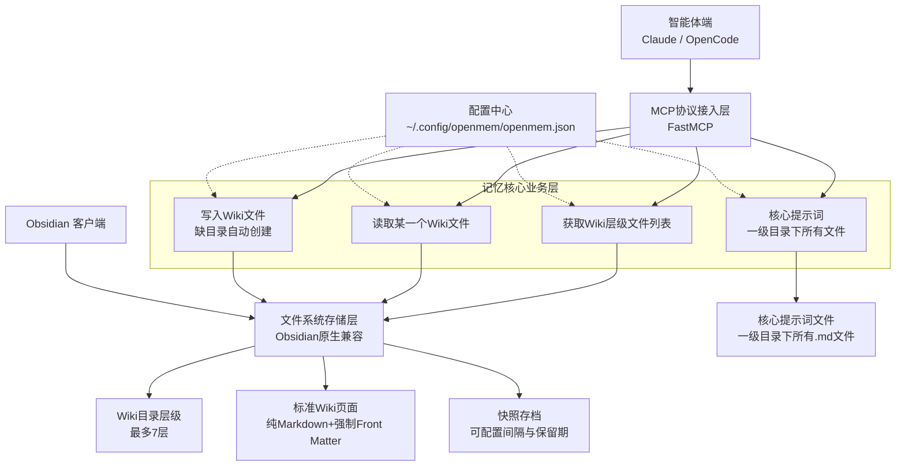

# 纯文件系统驱动的Wiki式记忆MCP工具（极简无依赖）


## 一、架构概览




## 二、文件系统存储层

### 2.1 根目录结构

```
wiki-root/
├── 记忆管理规则.md              # 核心提示词：记忆分类、合并、过期等管理规则
├── 用户偏好习惯.md              # 核心提示词：用户沟通风格、习惯表达、个人偏好
├── Agent行为指南.md             # 核心提示词：Agent写入行为规范与决策边界
├── Wiki整理指南.md              # 核心提示词：Wiki结构整理与内容归并规范
├── 00-个人/                    # 一级目录
│   ├── 健康.md
│   └── 学习/                   # 二级目录
│       └── Python学习笔记.md
├── 01-工作/
│   └── 项目A.md
└── 02-知识库/
```

### 2.2 核心提示词文件

位于Wiki根目录（一级目录）下的所有 `.md` 文件均为核心提示词文件，写入引擎在每次执行写入前必须读取**所有**核心提示词文件作为决策依据。

**核心提示词文件列表**（并列关系，各司其职）：

| 文件 | 职责 | 说明 |
|------|------|------|
| `记忆管理规则.md` | 记忆分类与合并 | 定义记忆的层次、分类、合并、过期等管理规则 |
| `用户偏好习惯.md` | 用户个性化 | 记录用户沟通风格、习惯表达、个人偏好等 |
| `Agent行为指南.md` | 写入行为规范 | 定义Agent写入行为规范、决策边界、何时主动/被动写入 |
| `Wiki整理指南.md` | 结构整理与归并 | 定义Wiki目录结构整理、内容归并、冗余消除等规范 |

**`记忆管理规则.md` 内容示例**：

```markdown
---
title: 记忆管理规则
type: corepage
level: 1
summary: "记忆系统的核心管理规则，指导所有写入和合并决策。"
tags: ["核心", "规则"]
---
# 记忆管理规则

## 核心原则
记忆有层次和顺序，但是内容精简不重叠。

## 单篇原则
每篇笔记仅讲述一个概念/方法/知识点。

## 合并原则
若以下四项中任意三项相同，则需要合并：
- 主体（谁/什么）
- 核心动作（做什么）
- 特点/条件（在什么情况下）
- 结论/观点（结果是什么）
```

**`用户偏好习惯.md` 内容示例**：

```markdown
---
title: 用户偏好习惯
type: corepage
level: 1
summary: "用户的沟通风格与个人偏好记录。"
tags: ["核心", "偏好"]
---
# 用户偏好习惯

## 沟通风格
- 偏好简洁直接的回答
- 不喜欢过多寒暄和解释

## 工作习惯
- 使用4空格缩进
- 函数名驼峰命名，变量名下划线命名
```

**`Agent行为指南.md` 内容示例**：

```markdown
---
title: Agent行为指南
type: corepage
level: 1
summary: "Agent写入行为规范与决策边界。"
tags: ["核心", "指南"]
---
# Agent行为指南

## 主动写入场景
- 用户明确要求记住某事
- 用户纠正Agent的错误认知

## 被动写入场景
- 仅在用户触发时写入，不主动猜测

## 写入边界
- 不记录临时性对话上下文
- 不记录已过期的任务信息
```

**`Wiki整理指南.md` 内容示例**：

```markdown
---
title: Wiki整理指南
type: corepage
level: 1
summary: "Wiki目录结构整理与内容归并规范，指导Agent定期维护知识库结构清晰与内容精简。"
tags: ["核心", "整理"]
---
# Wiki整理指南

## 整理原则

### 结构原则
- 目录层级不超过7层，优先3层以内组织
- 同一主题的内容归入同一目录，不同主题分目录存放
- 目录命名使用"序号-名称"格式，如"01-工作"、"02-学习"
- 空目录应当删除，避免结构冗余

### 归并原则
- 遵循"记忆管理规则"中的合并原则
- 两篇页面若主题高度重叠，应合并为一篇
- 合并后保留信息更完整的版本作为基底，补充另一篇的独特内容
- 合并完成后，将冗余页面内容迁移并删除原页面

### 单篇原则
- 每篇页面仅讲述一个概念/方法/知识点
- 页面内容超过500字时，考虑拆分为子页面
- 页面内容不足20字时，考虑归并到相关父页面或兄弟页面

## 整理流程

### 第一步：诊断现状
1. 使用 `get_directory` 获取当前Wiki完整目录树
2. 使用 `run_health_check` 检查结构健康度，关注warnings和suggestions
3. 识别以下问题：
   - 空目录（无子页面）
   - 过短页面（内容不足20字）
   - 过长页面（内容超过500字）
   - 重叠页面（主题相似的兄弟页面）

### 第二步：制定整理方案
1. 标记需要合并的页面组（基于合并原则判断）
2. 标记需要拆分的页面（内容过长且包含多个独立主题）
3. 标记需要删除的空目录
4. 确定目标目录结构

### 第三步：执行整理
1. 读取待合并页面：使用 `read_memory` 获取完整内容
2. 合并内容：使用 `write_memory` 以merge模式写入目标页面
3. 删除冗余页面：合并完成后用 `write_memory` 覆盖为重定向说明
4. 创建新目录：使用 `create_directory` 建立新分类
5. 迁移内容：将拆分出的子主题 `write_memory` 到新路径
6. 更新摘要：每次修改后确保summary准确反映页面内容

### 第四步：验证整理结果
1. 再次 `run_health_check` 确认无新增错误
2. `get_directory` 确认目录结构符合预期
3. `read_memory` 抽检关键页面内容完整性

## 整理触发时机
- 用户明确要求整理Wiki
- `run_health_check` 报告3个以上warnings
- 用户写入新记忆后，检测到潜在的结构冲突
- 定期整理（建议每周一次）

## 注意事项
- 整理前务必确认快照机制已启用，确保可恢复
- 一次整理操作涉及的页面不超过10篇，避免大规模变动
- 核心提示词文件（一级目录下.md文件）不参与整理归并
- 整理过程中如发现用户偏好信息，应更新到"用户偏好习惯.md"
```

> **扩展规则**：用户可自行在Wiki根目录下新增 `.md` 文件作为新的核心提示词，系统自动识别一级目录下所有 `.md` 文件为核心提示词，无需额外配置。

### 2.3 Wiki页面Front Matter规范

使用 `python-frontmatter` 库解析Markdown文件的YAML头部，所有Markdown文件必须包含以下Front Matter字段：

```markdown
---
title: Python学习笔记
type: page
level: 3
summary: "Python基础语法、常用库介绍和学习资源汇总。包含NumPy、Pandas等数据科学库的使用方法。"
tags: ["python", "编程", "学习"]
---
# Python学习笔记
## 基础语法
Python是一种解释型、面向对象的高级编程语言...
```

**字段说明**：
| 字段 | 说明 | 强制 |
|------|------|------|
| `title` | 页面标题 | ✅ |
| `type` | 类型：`page` | ✅ |
| `level` | 层级：1-7 | ✅ |
| `summary` | 100字以内摘要 | ✅ |
| `tags` | 标签列表 | ✅ |


### 2.4 7层深度限制

- 根目录文件：level=1
- 一级子目录内文件：level=2
- ...
- 最深层级：level=7
- 任何尝试创建超过7层目录的操作都会被拒绝


## 三、记忆核心业务层

### 3.1 获取Wiki层级文件列表（get_directory）

获取指定目录下的文件和子目录列表，用于导航和浏览Wiki结构。

```python
@mcp.tool()
def get_directory(path: str = "/") -> str:
    """
    获取指定目录的层级文件列表

    Args:
        path: 目录路径，默认根目录

    Returns:
        目录结构和子条目列表（含每个条目的title、summary、type、level）
    """
    pass
```

**返回格式**（树形目录结构，递归展示子条目）：
```json
{
    "path": "/",
    "name": "wiki-root",
    "type": "directory",
    "children": [
        {
            "name": "记忆管理原则.md",
            "type": "page",
            "level": 1,
            "title": "记忆管理原则",
            "summary": "记忆系统的核心管理原则"
        },
        {
            "name": "00-个人",
            "type": "directory",
            "level": 1,
            "children": [
                {
                    "name": "健康.md",
                    "type": "page",
                    "level": 2,
                    "title": "健康",
                    "summary": "健康记录与运动计划"
                },
                {
                    "name": "学习",
                    "type": "directory",
                    "level": 2,
                    "children": [
                        {
                            "name": "Python学习笔记.md",
                            "type": "page",
                            "level": 3,
                            "title": "Python学习笔记",
                            "summary": "Python基础语法与常用库介绍"
                        }
                    ]
                }
            ]
        },
        {
            "name": "01-工作",
            "type": "directory",
            "level": 1,
            "children": [
                {
                    "name": "项目A.md",
                    "type": "page",
                    "level": 2,
                    "title": "项目A",
                    "summary": "项目A的进展与关键信息"
                }
            ]
        },
        {
            "name": "02-知识库",
            "type": "directory",
            "level": 1,
            "children": []
        }
    ]
}
```

### 3.2 读取某一个Wiki文件（read_memory）

读取指定路径的Wiki页面完整内容，包括Front Matter和正文。

```python
@mcp.tool()
def read_memory(path: str) -> str:
    """
    读取指定路径的完整Wiki页面内容

    Args:
        path: 页面完整路径，如"/00-个人/学习/Python学习笔记"

    Returns:
        页面完整内容，包括Front Matter
    """
    pass
```

### 3.3 写入Wiki文件（write_memory）

```python
@mcp.tool()
def write_memory(path: str = None, tags: list[str] = None, content: str) -> str:
    """
    写入记忆

    Args:
        path: 目标路径，如"/00-个人/学习/Python学习笔记"。为空时自动分类
        tags: 可选的标签列表
        content: 要写入的记忆内容

    Returns:
        最终页面路径
    """
    pass
```

**缺目录自动创建**：若目标路径的父目录不存在，自动逐级创建目录

### 3.4 核心提示词

核心提示词存储在Wiki一级目录下的所有 `.md` 文件中，写入引擎在每次写入前自动读取全部核心提示词文件。

可通过专用接口获取所有核心提示词：

```python
@mcp.tool()
def get_core_principles() -> str:
    """
    获取所有核心提示词（一级目录下所有.md文件的内容合集）

    Returns:
        所有核心提示词的完整内容，按文件名排列拼接
    """
    pass
```


## 四、快照存档机制

### 4.1 核心规则

- 文件的**每次改动**前，对原文件创建快照存档
- 快照存储在Wiki根目录下的 `.snapshots/` 隐藏目录中
- 快照按时间和文件路径组织

### 4.2 快照目录结构

```
wiki-root/
├── .snapshots/
│   └── 00-个人/
│       └── 学习/
│           └── Python学习笔记/
│               ├── 2026-07-03T10-00-00.md
│               ├── 2026-07-03T10-30-00.md
│               └── 2026-07-03T11-00-00.md
```

### 4.3 定期清理

- 每 **10分钟** 执行一次清理检查（可配置）
- 快照保留 **7天**（可配置）
- 超过保留期的快照自动删除

### 4.4 配置项

配置文件位于 `Path.home() / ".config" / "openmem" / "openmem.json"`，不在Wiki根目录内：

```json
{
    "wiki_root": "./wikitest0525",
    "max_depth": 7,
    "snapshot": {
        "enabled": true,
        "cleanup_interval_minutes": 10,
        "retention_days": 7
    },
    "default_tags": [],
    "logging": {
        "level": "INFO",
        "file_enabled": true,
        "file_path": "./logs/openmem.log",
        "max_file_size_mb": 10,
        "backup_count": 5,
        "format": "%(asctime)s | %(levelname)-8s | %(name)s | %(message)s"
    }
}
```


## 五、日志策略

### 5.1 日志级别

| 级别 | 用途 | 示例 |
|------|------|------|
| `DEBUG` | 详细调试信息，开发阶段使用 | 文件Front Matter解析细节、目录遍历过程 |
| `INFO` | 关键操作记录，生产环境默认级别 | 页面创建/更新/删除、快照创建、搜索执行 |
| `WARNING` | 异常但可恢复的情况 | 合并冲突自动解决、快照清理跳过被占用文件 |
| `ERROR` | 操作失败 | 文件写入失败、路径超7层限制、权限不足 |

### 5.2 日志输出目标

| 输出目标 | 说明 | 配置项 |
|----------|------|--------|
| **控制台（stderr）** | 始终启用，用于开发调试 | 不可关闭 |
| **文件** | 可选启用，按天轮转 | `logging.file_enabled`、`logging.file_path` |

### 5.3 文件日志轮转策略

- **单文件大小上限**：`max_file_size_mb`（默认10MB），超过后自动轮转
- **保留文件数**：`backup_count`（默认5个），即 `openmem.log` + 5个历史文件
- **轮转命名**：`openmem.log` → `openmem.log.1` → `openmem.log.2` → ...
- **最老文件自动删除**：超过 `backup_count` 的历史文件自动清理

### 5.4 日志格式

```
2026-07-03 10:30:00,123 | INFO     | openmem.write | 创建页面: /00-个人/学习/Python学习笔记
2026-07-03 10:30:01,456 | WARNING  | openmem.merge | 合并冲突自动解决: /01-工作/项目A
2026-07-03 10:30:02,789 | ERROR    | openmem.store | 写入失败: 权限不足 /02-知识库/机密.md
```

格式模板：`%(asctime)s | %(levelname)-8s | %(name)s | %(message)s`

### 5.5 关键操作的日志记录点

| 操作 | 日志级别 | 记录内容 |
|------|----------|----------|
| 页面创建 | INFO | 路径、标题、来源 |
| 页面更新 | INFO | 路径、模式（merge/append/overwrite） |
| 页面合并 | INFO | 源路径、目标路径、合并策略 |
| 快照创建 | DEBUG | 源路径、快照文件路径 |
| 快照清理 | INFO | 清理数量、释放空间 |
| 目录自动创建 | INFO | 创建的目录路径 |
| 7层深度拒绝 | WARNING | 被拒绝的路径、当前深度 |
| 核心提示词读取 | DEBUG | 读取的文件列表 |
| 搜索执行 | INFO | 查询关键词、结果数量、耗时 |
| 健康检查 | INFO | 检查结果摘要 |
| 导出执行 | INFO | 导出路径、文件数量、总大小 |
| 文件写入失败 | ERROR | 路径、错误原因 |
| 配置加载 | INFO | 配置文件路径、关键参数 |


## 六、MCP工具接口汇总

```python
from fastmcp import FastMCP

mcp = FastMCP("Personal Wiki Memory")

# 记忆核心业务层 - 3个核心功能
@mcp.tool()
def get_directory(path: str = "/") -> str:
    """获取Wiki层级文件列表（树形目录结构）"""
    pass

@mcp.tool()
def read_memory(path: str) -> str:
    """读取记忆"""
    pass

@mcp.tool()
def write_memory(content: str, path: str = None, mode: str = "merge", tags: list[str] = None) -> str:
    """写入记忆（缺目录自动创建，更新前自动快照）"""
    pass

@mcp.tool()
def get_core_principles() -> str:
    """获取所有核心提示词（一级目录下所有.md文件的内容合集）"""
    pass

```


## 七、项目代码骨架

### 7.1 模块结构

```
openmem/
├── __init__.py
├── __main__.py
├── main.py              # 入口：启动MCP，自动初始化
├── config.py            # 配置加载与管理
├── file_store.py        # 文件系统存储层：读写页面、目录树、快照
├── write_engine.py      # 写入引擎：分类、合并、核心提示词驱动
├── read_engine.py       # 读取引擎：搜索、渐进式匹配
├── health_engine.py     # 健康检查引擎
├── snapshot_manager.py  # 快照管理：创建、清理
└── initializer.py       # 启动初始化：创建配置、Wiki根目录、核心提示词文件
```

### 7.2 启动初始化模块（initializer.py）

```python
import json
import shutil
import logging
from pathlib import Path
from datetime import datetime

logger = logging.getLogger(__name__)

DEFAULT_CONFIG = {
    "wiki_root": "./wiki",
    "max_depth": 7,
    "snapshot": {
        "enabled": True,
        "cleanup_interval_minutes": 10,
        "retention_days": 7
    },
    "default_tags": [],
    "logging": {
        "level": "INFO",
        "file_enabled": True,
        "file_path": "./logs/openmem.log",
        "max_file_size_mb": 10,
        "backup_count": 5,
        "format": "%(asctime)s | %(levelname)-8s | %(name)s | %(message)s"
    }
}

CORE_PROMPTS = {
    "记忆管理规则.md": {
        "title": "记忆管理规则",
        "summary": "记忆系统的核心管理规则，指导所有写入和合并决策。",
        "tags": ["核心", "规则"],
        "content": (
            "# 记忆管理规则\n\n"
            "## 核心原则\n"
            "记忆有层次和顺序，但是内容精简不重叠。\n\n"
            "## 单篇原则\n"
            "每篇笔记仅讲述一个概念/方法/知识点。\n\n"
            "## 合并原则\n"
            "若以下四项中任意三项相同，则需要合并：\n"
            "- 主体（谁/什么）\n"
            "- 核心动作（做什么）\n"
            "- 特点/条件（在什么情况下）\n"
            "- 结论/观点（结果是什么）"
        )
    },
    "用户偏好习惯.md": {
        "title": "用户偏好习惯",
        "summary": "用户的沟通风格与个人偏好记录。",
        "tags": ["核心", "偏好"],
        "content": (
            "# 用户偏好习惯\n\n"
            "## 沟通风格\n"
            "- 偏好简洁直接的回答\n"
            "- 不喜欢过多寒暄和解释\n\n"
            "## 工作习惯\n"
            "- 使用4空格缩进\n"
            "- 函数名驼峰命名，变量名下划线命名"
        )
    },
    "Agent行为指南.md": {
        "title": "Agent行为指南",
        "summary": "Agent写入行为规范与决策边界。",
        "tags": ["核心", "指南"],
        "content": (
            "# Agent行为指南\n\n"
            "## 主动写入场景\n"
            "- 用户明确要求记住某事\n"
            "- 用户纠正Agent的错误认知\n\n"
            "## 被动写入场景\n"
            "- 仅在用户触发时写入，不主动猜测\n\n"
            "## 写入边界\n"
            "- 不记录临时性对话上下文\n"
            "- 不记录已过期的任务信息"
        )
    },
    "Wiki整理指南.md": {
        "title": "Wiki整理指南",
        "summary": "Wiki目录结构整理与内容归并规范，指导Agent定期维护知识库结构清晰与内容精简。",
        "tags": ["核心", "整理"],
        "content": (
            "# Wiki整理指南\n\n"
            "## 整理原则\n\n"
            "### 结构原则\n"
            "- 目录层级不超过7层，优先3层以内组织\n"
            "- 同一主题的内容归入同一目录，不同主题分目录存放\n"
            "- 目录命名使用"序号-名称"格式，如"01-工作"、"02-学习"\n"
            "- 空目录应当删除，避免结构冗余\n\n"
            "### 归并原则\n"
            "- 遵循"记忆管理规则"中的合并原则\n"
            "- 两篇页面若主题高度重叠，应合并为一篇\n"
            "- 合并后保留信息更完整的版本作为基底，补充另一篇的独特内容\n"
            "- 合并完成后，将冗余页面内容迁移并删除原页面\n\n"
            "### 单篇原则\n"
            "- 每篇页面仅讲述一个概念/方法/知识点\n"
            "- 页面内容超过500字时，考虑拆分为子页面\n"
            "- 页面内容不足20字时，考虑归并到相关父页面或兄弟页面\n\n"
            "## 整理流程\n\n"
            "### 第一步：诊断现状\n"
            "1. 使用 `get_directory` 获取当前Wiki完整目录树\n"
            "2. 使用 `run_health_check` 检查结构健康度，关注warnings和suggestions\n"
            "3. 识别以下问题：\n"
            "   - 空目录（无子页面）\n"
            "   - 过短页面（内容不足20字）\n"
            "   - 过长页面（内容超过500字）\n"
            "   - 重叠页面（主题相似的兄弟页面）\n\n"
            "### 第二步：制定整理方案\n"
            "1. 标记需要合并的页面组（基于合并原则判断）\n"
            "2. 标记需要拆分的页面（内容过长且包含多个独立主题）\n"
            "3. 标记需要删除的空目录\n"
            "4. 确定目标目录结构\n\n"
            "### 第三步：执行整理\n"
            "1. 读取待合并页面：使用 `read_memory` 获取完整内容\n"
            "2. 合并内容：使用 `write_memory` 以merge模式写入目标页面\n"
            "3. 删除冗余页面：合并完成后用 `write_memory` 覆盖为重定向说明\n"
            "4. 创建新目录：使用 `create_directory` 建立新分类\n"
            "5. 迁移内容：将拆分出的子主题 `write_memory` 到新路径\n"
            "6. 更新摘要：每次修改后确保summary准确反映页面内容\n\n"
            "### 第四步：验证整理结果\n"
            "1. 再次 `run_health_check` 确认无新增错误\n"
            "2. `get_directory` 确认目录结构符合预期\n"
            "3. `read_memory` 抽检关键页面内容完整性\n\n"
            "## 整理触发时机\n"
            "- 用户明确要求整理Wiki\n"
            "- `run_health_check` 报告3个以上warnings\n"
            "- 用户写入新记忆后，检测到潜在的结构冲突\n"
            "- 定期整理（建议每周一次）\n\n"
            "## 注意事项\n"
            "- 整理前务必确认快照机制已启用，确保可恢复\n"
            "- 一次整理操作涉及的页面不超过10篇，避免大规模变动\n"
            "- 核心提示词文件（一级目录下.md文件）不参与整理归并\n"
            "- 整理过程中如发现用户偏好信息，应更新到"用户偏好习惯.md""
        )
    }
}


def ensure_config(config_path: Path) -> Path:
    if config_path.exists():
        logger.info(f"配置文件已存在: {config_path}")
        return config_path

    config_path.parent.mkdir(parents=True, exist_ok=True)
    with open(config_path, "w", encoding="utf-8") as f:
        json.dump(DEFAULT_CONFIG, f, indent=4, ensure_ascii=False)
    logger.info(f"已创建默认配置文件: {config_path}")
    return config_path


def ensure_wiki_root(wiki_root: Path):
    wiki_root.mkdir(parents=True, exist_ok=True)
    logger.info(f"Wiki根目录已就绪: {wiki_root}")


def ensure_core_prompts(wiki_root: Path):
    for filename, prompt_data in CORE_PROMPTS.items():
        file_path = wiki_root / filename
        if file_path.exists():
            logger.debug(f"核心提示词文件已存在，跳过: {filename}")
            continue

        front_matter = {
            "title": prompt_data["title"],
            "type": "corepage",
            "level": 1,
            "summary": prompt_data["summary"],
            "tags": prompt_data["tags"],
            "created_at": datetime.now().isoformat(),
            "updated_at": datetime.now().isoformat()
        }

        yaml_header = "---\n"
        for key, value in front_matter.items():
            if isinstance(value, list):
                yaml_header += f'{key}: {json.dumps(value, ensure_ascii=False)}\n'
            elif isinstance(value, str):
                yaml_header += f'{key}: "{value}"\n'
            else:
                yaml_header += f"{key}: {value}\n"
        yaml_header += "---\n"

        with open(file_path, "w", encoding="utf-8") as f:
            f.write(yaml_header + "\n" + prompt_data["content"] + "\n")

        logger.info(f"已创建核心提示词文件: {filename}")


def initialize(config_path: Path, wiki_root: Path):
    logger.info("开始启动初始化...")

    config_path = ensure_config(config_path)
    ensure_wiki_root(wiki_root)
    ensure_core_prompts(wiki_root)

    logger.info("启动初始化完成")
```

### 7.3 主入口（main.py）

```python
import logging
import logging.handlers
from pathlib import Path
from fastmcp import FastMCP
from openmem.config import Config
from openmem.file_store import FileStore
from openmem.snapshot_manager import SnapshotManager
from openmem.write_engine import WriteEngine
from openmem.read_engine import ReadEngine
from openmem.health_engine import HealthEngine
from openmem.initializer import initialize

CONFIG_PATH = Path.home() / ".config" / "openmem" / "openmem.json"
mcp = FastMCP("Personal Wiki Memory")

initialize(CONFIG_PATH)

config = Config(str(CONFIG_PATH))

file_store = FileStore(config.wiki_root, config.max_depth)
snapshot_mgr = SnapshotManager(
    wiki_root=config.wiki_root,
    enabled=config.snapshot_enabled,
    cleanup_interval_minutes=config.snapshot_cleanup_interval,
    retention_days=config.snapshot_retention_days
)
write_engine = WriteEngine(file_store, snapshot_mgr)
read_engine = ReadEngine(file_store)
health_engine = HealthEngine(file_store)


@mcp.tool()
def get_directory(path: str = "/") -> str:
    return file_store.read_directory_tree(path)

@mcp.tool()
def read_memory(path: str) -> str:
    return file_store.read_page(path)

@mcp.tool()
def write_memory(content: str, path: str = None, mode: str = "merge", tags: list[str] = None) -> str:
    principles = file_store.read_all_core_principles()
    exists = path and file_store.page_exists(path)
    if exists:
        snapshot_mgr.create_snapshot(path)
        file_store.update_page(path, content, mode, principles)
        return path
    else:
        file_store.ensure_directory_exists(path)
        return file_store.write_memory(content, path, tags, principles)

@mcp.tool()
def get_core_principles() -> str:
    return file_store.read_all_core_principles()


if __name__ == "__main__":
    mcp.run()
```

### 7.4 启动流程

```
MCP启动
  │
  ├─ 1. initialize(config_path, wiki_root)
  │     ├─ ensure_config()      → 若 openmem.json 不存在，创建默认配置
  │     ├─ ensure_wiki_root()   → 若 Wiki根目录不存在，自动创建
  │     └─ ensure_core_prompts()→ 若核心提示词文件不存在，逐个创建
  │         ├─ 记忆管理规则.md
  │         ├─ 用户偏好习惯.md
  │         ├─ Agent行为指南.md
  │         └─ Wiki整理指南.md
  │
  ├─ 2. Config.load()           → 读取配置
  ├─ 3. FileStore()             → 初始化文件存储
  ├─ 4. SnapshotManager()       → 初始化快照管理
  ├─ 5. WriteEngine()           → 初始化写入引擎
  ├─ 6. ReadEngine()            → 初始化读取引擎
  ├─ 7. HealthEngine()          → 初始化健康检查引擎
  │
  └─ 8. mcp.run()               → 启动MCP服务
```

### 7.5 安装

```bash
pip install openmem-mcp
```

或开发模式：

```bash
cd openmem-mcp
pip install -e .
```


## 八、核心优势总结

1. **极致简单**：没有数据库、没有LLM依赖、没有索引、没有缓存，只有文件系统
2. **100%可控**：没有后台进程、没有自动同步，所有操作显式可见
3. **零锁定**：所有数据都是标准Markdown，随时可用任何编辑器打开
4. **完美Obsidian集成**：不需要任何插件，所有功能都是Obsidian原生支持
5. **强制规范**：所有文件都遵循统一格式，结构清晰、易于维护
6. **记忆不重叠**：核心提示词驱动合并判断，确保内容精简不冗余
7. **安全可恢复**：每次改动自动快照，可配置保留策略


## 附录A：FastMCP 使用指南

> 基于 fastmcp 3.3.1 源码分析整理，涵盖工具名称、描述、参数说明、日志、资源、Prompt 等配置方法。

### A.1 工具注册（@mcp.tool）

#### A.1.1 工具名称

通过 `@mcp.tool(name="xxx")` 显式指定；不指定则默认使用函数名。

```python
# 方式1：显式指定名称
@mcp.tool(name="add_memory")
def add_memory(content: str) -> str:
    pass

# 方式2：位置参数指定名称
@mcp.tool("add_memory")
def add_memory(content: str) -> str:
    pass

# 方式3：不指定，默认函数名 "add_memory"
@mcp.tool()
def add_memory(content: str) -> str:
    pass
```

**源码位置**：`fastmcp/tools/function_tool.py:214` — `func_name = metadata.name or parsed_fn.name`

#### A.1.2 工具描述

通过 `@mcp.tool(description="xxx")` 显式指定；不指定则自动从函数 docstring 解析首段文本。

```python
# 方式1：显式指定描述
@mcp.tool(description="添加新记忆，自动分类到最合适的Wiki位置")
def add_memory(content: str) -> str:
    pass

# 方式2：从docstring自动提取
@mcp.tool()
def add_memory(content: str) -> str:
    """
    添加新记忆，自动分类到最合适的Wiki位置
    """
    pass
```

**优先级**：`description` 参数 > docstring 首段文本

**源码位置**：`fastmcp/tools/function_tool.py:268-270`
```python
description=metadata.description
if metadata.description is not None
else parsed_fn.description,
```

其中 `parsed_fn.description` 来自 docstring 解析（详见 A.1.3）。

#### A.1.3 参数说明

参数说明通过 **docstring 的 Args 段落** 配置，底层使用 `griffe` 库解析，支持 Google、NumPy、Sphinx 三种格式（按序尝试，取首个成功解析到参数描述的）。

**Google 风格（推荐）**：

```python
@mcp.tool()
def search_memories(query: str, max_depth: int = 7, max_results: int = 3) -> str:
    """
    搜索记忆，从根目录开始渐进式查找

    Args:
        query: 搜索查询关键词
        max_depth: 最大搜索深度，默认7
        max_results: 最多返回结果数，默认3

    Returns:
        结构化的搜索结果
    """
    pass
```

**NumPy 风格**：

```python
@mcp.tool()
def search_memories(query, max_depth=7, max_results=3):
    """
    搜索记忆，从根目录开始渐进式查找

    Parameters
    ----------
    query : str
        搜索查询关键词
    max_depth : int, optional
        最大搜索深度，默认7
    max_results : int, optional
        最多返回结果数，默认3

    Returns
    -------
    str
        结构化的搜索结果
    """
    pass
```

**Sphinx 风格**：

```python
@mcp.tool()
def search_memories(query, max_depth=7, max_results=3):
    """
    搜索记忆，从根目录开始渐进式查找

    :param query: 搜索查询关键词
    :param max_depth: 最大搜索深度，默认7
    :param max_results: 最多返回结果数，默认3
    :return: 结构化的搜索结果
    """
    pass
```

**Pydantic Field 描述**（优先级高于 docstring）：

```python
from pydantic import Field

@mcp.tool()
def add_memory(
    content: str = Field(description="要添加的记忆内容"),
    path: str = Field(default=None, description="可选的建议路径，如'/00-个人/学习'"),
) -> str:
    pass
```

**优先级**：`Field(description=...)` / `Annotated[type, "描述"]` > docstring Args 段落

**源码位置**：
- docstring 解析：`fastmcp/utilities/docstring_parsing.py` — `parse_docstring()` 函数
- 参数描述注入 JSON Schema：`fastmcp/tools/function_parsing.py` 中，docstring Args 的描述仅在该参数尚未有 description 时注入（不会覆盖 Field 描述）

#### A.1.4 参数类型与 JSON Schema

FastMCP 使用 Pydantic 的 `TypeAdapter` 自动从 Python 类型注解生成 JSON Schema，客户端看到的所有参数信息（类型、描述、默认值、必填/选填）均由此生成。

```python
@mcp.tool()
def write_memory(
    content: str,                                    # 必填，类型string
    path: str = None,                                # 选填，类型string|null
    mode: str = "merge",                             # 选填，默认"merge"
    tags: list[str] = None,                          # 选填，类型array of string
) -> str:
    pass
```

客户端收到的 `inputSchema` 大致为：
```json
{
    "type": "object",
    "properties": {
        "content": {"type": "string", "description": "要写入的记忆内容"},
        "path": {"type": "string", "description": "目标路径", "default": null},
        "mode": {"type": "string", "description": "更新模式", "default": "merge"},
        "tags": {"type": "array", "items": {"type": "string"}, "description": "标签列表"}
    },
    "required": ["content"]
}
```


### A.2 资源注册（@mcp.resource）

#### A.2.1 基本用法

```python
@mcp.resource("wiki://config")
def get_config() -> str:
    """获取当前Wiki配置信息"""
    return "..."
```

#### A.2.2 可配置参数

```python
@mcp.resource(
    uri="wiki://page/{path}",        # 资源URI（必填），支持模板参数
    name="get_page",                 # 资源名称，默认函数名
    title="Wiki页面",                # 显示标题
    description="获取Wiki页面内容",   # 描述，fallback到docstring
    mime_type="text/markdown",       # MIME类型，默认text/plain
    tags={"wiki", "page"},           # 标签集合
    icons=None,                      # 图标列表
    annotations=None,                # MCP Annotations对象
    meta=None,                       # 自定义元数据字典
)
def get_page(path: str) -> str:
    pass
```

#### A.2.3 URI 模板语法（RFC 6570 子集）

| 语法 | 说明 | 示例 |
|------|------|------|
| `{var}` | 路径参数，匹配单个段 | `wiki://page/{path}` → `wiki://page/Python学习笔记` |
| `{var*}` | 通配路径参数，匹配多段 | `wiki://file/{path*}` → `wiki://file/00-个人/学习/笔记` |
| `{?var1,var2}` | 查询参数，必须为可选参数 | `wiki://search/{query}{?limit,offset}` → `wiki://search/python?limit=10` |

**模板参数约束**：
- URI 中的路径参数必须覆盖函数的所有必填参数
- 查询参数（`{?...}`）对应的函数参数必须有默认值
- URI 参数名中连字符自动转下划线匹配 Python 参数名（如 `{user-id}` 对应 `user_id`）

```python
@mcp.resource("wiki://search/{query}{?limit,offset}")
def search(query: str, limit: int = 10, offset: int = 0) -> str:
    """搜索Wiki内容"""
    pass
```

#### A.2.4 资源 vs 资源模板

FastMCP 自动区分：
- **无参数的资源**（函数无参数且 URI 无 `{}`）：注册为静态 `FunctionResource`
- **有参数的资源**（URI 含 `{}` 或函数有参数）：注册为 `FunctionResourceTemplate`

**源码位置**：`fastmcp/resources/function_resource.py:274-311`


### A.3 Prompt 注册（@mcp.prompt）

#### A.3.1 基本用法

```python
@mcp.prompt(name="summarize", description="总结文档内容")
def summarize_prompt(document: str, max_length: int = 100) -> str:
    """
    生成文档摘要

    Args:
        document: 要总结的文档内容
        max_length: 摘要最大长度
    """
    return f"请总结以下内容，控制在{max_length}字以内：\n{document}"
```

#### A.3.2 可配置参数

```python
@mcp.prompt(
    name="summarize",                # Prompt名称，默认函数名
    title="文档摘要",                 # 显示标题
    description="总结文档内容",        # 描述，fallback到docstring
    icons=None,                      # 图标列表
    tags={"summary"},                # 标签集合
    meta=None,                       # 自定义元数据字典
)
def summarize_prompt(document: str) -> str:
    pass
```

#### A.3.3 返回值类型

Prompt 函数可返回以下类型：
- `str`：自动包装为单条 user Message
- `list[Message | str]`：转换为 Message 列表
- `PromptResult`：直接使用

#### A.3.4 参数说明注入

与 Tool 相同，Prompt 的参数说明也从 docstring Args 段落解析并注入到 `PromptArgument.description` 中。对于非 string 类型的参数，FastMCP 会自动在描述末尾追加 JSON Schema 信息，帮助客户端以字符串格式传参。

**源码位置**：`fastmcp/prompts/function_prompt.py:208-259`

#### A.3.5 限制

- 不支持 `*args` 和 `**kwargs`
- Lambda 函数必须显式提供 `name`


### A.4 日志配置

#### A.4.1 FastMCP 内置日志系统

FastMCP 使用 `fastmcp.settings`（`Settings` 类实例）控制日志行为，所有设置均可通过环境变量覆盖：

| 设置项 | 环境变量 | 默认值 | 说明 |
|--------|----------|--------|------|
| `log_enabled` | `FASTMCP_LOG_ENABLED` | `True` | 是否启用日志 |
| `log_level` | `FASTMCP_LOG_LEVEL` | `"INFO"` | 日志级别 |
| `enable_rich_logging` | `FASTMCP_ENABLE_RICH_LOGGING` | `True` | 是否使用 Rich 格式化输出 |
| `enable_rich_tracebacks` | `FASTMCP_ENABLE_RICH_TRACEBACKS` | `True` | 是否使用 Rich 异常追踪 |

**在代码中获取 logger**：

```python
from fastmcp.utilities.logging import get_logger
logger = get_logger(__name__)  # 返回名为 "fastmcp.{模块名}" 的 logger
```

**手动配置日志**：

```python
from fastmcp.utilities.logging import configure_logging

configure_logging(
    level="DEBUG",                    # 日志级别
    enable_rich_tracebacks=True,      # Rich异常追踪
)
```

**运行时修改设置**：

```python
import fastmcp
fastmcp.settings.log_level = "DEBUG"   # 自动生效
fastmcp.settings.log_enabled = False   # 关闭日志
```

**源码位置**：
- Settings 定义：`fastmcp/settings.py:136-181`
- 日志配置函数：`fastmcp/utilities/logging.py:29-113`

#### A.4.2 与项目自定义日志的关系

本项目（openmem）在 `main.py` 中使用 Python 标准 `logging` 模块自行配置日志，独立于 FastMCP 内置日志：

```python
logging.basicConfig(
    level=logging.INFO,
    format="%(asctime)s - %(name)s - %(levelname)s - %(message)s",
    handlers=[
        logging.FileHandler(str(log_path), encoding="utf-8"),
        logging.StreamHandler()
    ]
)
```

两者共存时，FastMCP 的 logger（`fastmcp.*`）由 FastMCP 内部管理，项目自身的 logger（`openmem.*`）由项目 `logging.basicConfig` 管理，互不干扰。

#### A.4.3 MCP 协议日志（发送给客户端）

FastMCP 支持通过 MCP 协议向客户端发送日志消息，由 `client_log_level` 设置控制：

| 设置项 | 环境变量 | 默认值 | 说明 |
|--------|----------|--------|------|
| `client_log_level` | `FASTMCP_CLIENT_LOG_LEVEL` | `None` | 发送给客户端的最低日志级别 |

可选值：`"debug"` / `"info"` / `"notice"` / `"warning"` / `"error"` / `"critical"` / `"alert"` / `"emergency"`

设为 `None` 则不主动发送日志给客户端。


### A.5 快速对照表

| 客户端可见项 | 配置位置 | 优先级 |
|-------------|---------|--------|
| 工具名称 | `@mcp.tool(name="...")` → 函数名 | name参数 > 函数名 |
| 工具描述 | `@mcp.tool(description="...")` → docstring首段 | description参数 > docstring |
| 参数名称 | Python 函数参数名 | — |
| 参数类型 | Python 类型注解（经 Pydantic TypeAdapter 生成 JSON Schema） | — |
| 参数描述 | `Field(description=...)` → docstring Args 段落 | Field > docstring Args |
| 参数必填/选填 | 函数签名默认值（无默认值=必填） | — |
| 资源名称 | `@mcp.resource(uri, name="...")` → 函数名 | name参数 > 函数名 |
| 资源描述 | `@mcp.resource(..., description="...")` → docstring | description参数 > docstring |
| 资源 MIME 类型 | `@mcp.resource(..., mime_type="...")` | 显式指定 > `text/plain` |
| Prompt 名称 | `@mcp.prompt(name="...")` → 函数名 | name参数 > 函数名 |
| Prompt 描述 | `@mcp.prompt(description="...")` → docstring | description参数 > docstring |
| Prompt 参数描述 | docstring Args 段落 | 与 Tool 相同 |


### A.6 装饰器参数总览

#### @mcp.tool() 完整参数

| 参数 | 类型 | 默认值 | 说明 |
|------|------|--------|------|
| `name` / 位置参数 | `str` | 函数名 | 工具名称 |
| `title` | `str` | `None` | 显示标题 |
| `description` | `str` | docstring | 工具描述 |
| `version` | `str \| int` | `None` | 工具版本号 |
| `icons` | `list[Icon]` | `None` | 图标列表 |
| `tags` | `set[str]` | `None` | 标签集合 |
| `annotations` | `ToolAnnotations \| dict` | `None` | MCP 工具行为注解 |
| `output_schema` | `dict` | 自动推断 | 输出 JSON Schema |
| `meta` | `dict` | `None` | 自定义元数据 |
| `enabled` | `bool` | `True` | 是否启用 |
| `timeout` | `float` | `None` | 执行超时（秒） |
| `run_in_thread` | `bool` | `True` | 同步函数是否在线程池执行 |
| `auth` | `AuthCheck \| list` | `None` | 授权检查 |

#### @mcp.resource() 完整参数

| 参数 | 类型 | 默认值 | 说明 |
|------|------|--------|------|
| `uri`（必填） | `str` | — | 资源 URI，支持模板参数 |
| `name` | `str` | 函数名 | 资源名称 |
| `title` | `str` | `None` | 显示标题 |
| `description` | `str` | docstring | 资源描述 |
| `version` | `str \| int` | `None` | 资源版本号 |
| `icons` | `list[Icon]` | `None` | 图标列表 |
| `mime_type` | `str` | `"text/plain"` | MIME 类型 |
| `tags` | `set[str]` | `None` | 标签集合 |
| `annotations` | `Annotations \| dict` | `None` | MCP 资源注解 |
| `meta` | `dict` | `None` | 自定义元数据 |

#### @mcp.prompt() 完整参数

| 参数 | 类型 | 默认值 | 说明 |
|------|------|--------|------|
| `name` / 位置参数 | `str` | 函数名 | Prompt 名称 |
| `title` | `str` | `None` | 显示标题 |
| `description` | `str` | docstring | Prompt 描述 |
| `version` | `str \| int` | `None` | 版本号 |
| `icons` | `list[Icon]` | `None` | 图标列表 |
| `tags` | `set[str]` | `None` | 标签集合 |
| `meta` | `dict` | `None` | 自定义元数据 |
